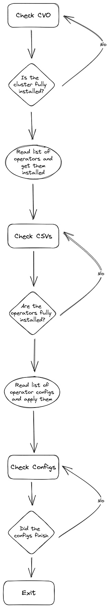

# Cluster0 Operators Deployer

This is a prototype that deploys a list of operators and operator configs onto the cluster0.

## How does it work?

The prototype is implemented as a CLI written in Go, but it can run in a `Pod` as well. So it can be used in an automated
way during the installation as well as on-demand.

The program reads a list of yaml manifests placed in two folders, one folder must have the operator installation files,
while the other must have the operator configuration files.

When the program starts it waits for the `ClusterVersionOperator` to finish the installation, once the CVO reports a
finished install, the program reads the yaml files for operator installations and applies them on the cluster. 
When a `Subscription` object is detected it waits for the `Subscription` to complete so once the configs are applied 
the required APIs are in place. Once all the `Subscriptions` are ready, the program applies the operators configuration
yaml files.

Once all files have been applied, the program exits. If running in a `Pod`, the `Pod` won't be restarted once the program
exits.

The execution flow followed by the program is something like this:

## Where do I define the operator install/config files?

The program accepts two parameters:

* `-i` or `--operators-install-manifests`
* `-c` or `--operators-config-manifests`

These parameters expect a path, inside that path you can create any number of yaml manifests you want. If you create them
using naming like `00_first.yaml`, `01_second.yaml`, etc. the order will be honored when applying the manifests.

When running in `Pod` mode you can create `ConfigMaps` with the installation/config files and mount them inside the `Pod`.
You can find an example in the following links:

* [Operator Install Files ConfigMap](https://github.com/RHsyseng/cluster0-operators/blob/main/deploy/manual/04_operator_install_files.yaml)
* [Operator Config Files ConfigMap](https://github.com/RHsyseng/cluster0-operators/blob/main/deploy/manual/05_operator_config_files.yaml)
* [Pod Mount](https://github.com/RHsyseng/cluster0-operators/blob/main/deploy/manual/06_pod.yaml#L20-L31)

## How can I automate this during OpenShift installation?

You can add pre-crafted files to your installation extra-manifests and once the cluster starts installing, the tool will
start and wait for the CVO to finish and eventually the yaml files will be applied. You have example `extra-manifests` files
[here](https://github.com/RHsyseng/cluster0-operators/tree/main/deploy/extra-manifests).
